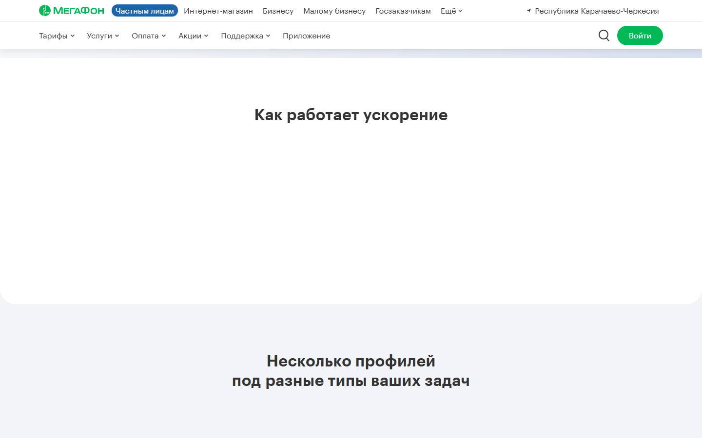
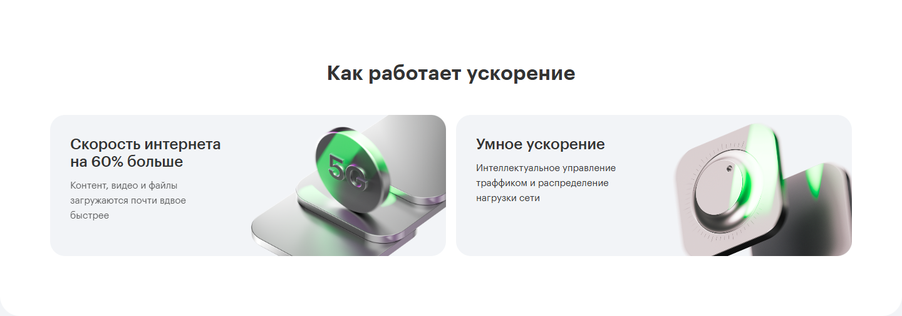
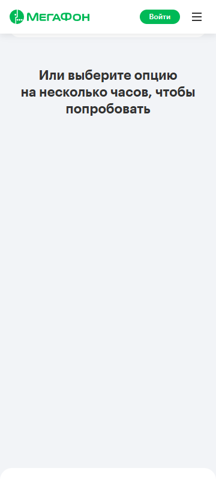
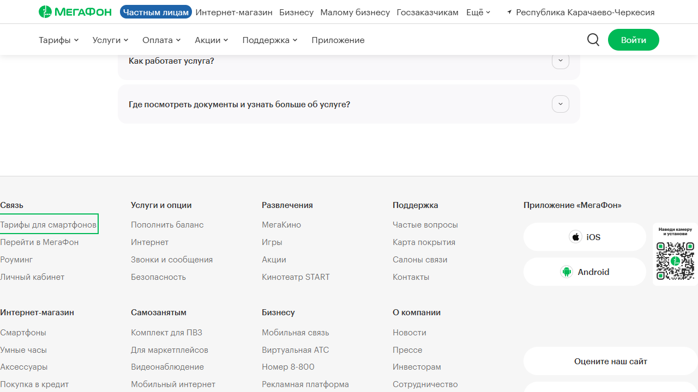
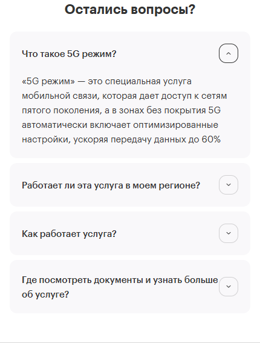

# Визуальный аудит desktop и mobile: результаты и исправления

Дата: **5 сентября 2026**. Исходный аудит выполнен на локальной версии после улучшений и очистки кода, относительно базового коммита `4062b4803fe0eab880bbe5e36ed2e0202ac7983e`. Затем исправления опубликованы коммитом кода `0226ef7`, сборка GitHub Pages — `aef73cf`. [Обновлённое демо](https://zhenchur.github.io/mega-5g-mobile-demo/) проверено отдельно на mobile/desktop; [результат публикации](qa/visual-fixes-2026-09-05/published.json).

## Результат

**Все пять замечаний исправлены и проверены 5 сентября 2026.** Обе карточки технологий отображаются при обычной анимации. «Мегаскорость» сохраняет видимость после восстановления reduced motion с фокусом, resize и возвращения скроллом. Полный набор — **36/36**, TypeScript и обе production-сборки проходят.

Исходный аудит выявил четыре новых замечания и подтвердил прежний N1. Ниже сохранены условия воспроизведения и исходные кадры для сравнения; текущий статус и доказательства исправлений приведены в первых двух таблицах.

| ID | Приоритет | Зона | Статус |
|---|---|---|---|
| V1 | P1 | Desktop: обе карточки технологий невидимы при включённых анимациях | Исправлен |
| V2 / N1 | P2 | Карточка «Мегаскорость» исчезает после восстановления motion с сохранённым фокусом | Исправлен в обеих версиях |
| V3 | P3 | Desktop 1280: футер без боковых отступов, срезан outline | Исправлен |
| V4 | P3 | Mobile 430: текст последнего FAQ почти касается круглой стрелки | Исправлен |
| V5 | P3 | Desktop: фон клиентской вкладки Connect насыщеннее, чем в Figma | Исправлен; расхождение контрольных точек ≤1 RGB |

P1 здесь означает исправление до передачи: V1 воспроизводится в обычном просмотре и убирает весь контент ключевой секции. P2 требует отдельного сценария. P3 — доводка отступов, без потери основного контента.

## Что изменилось и как проверено

| ID | Изменение | Проверка и кадр после исправления |
|---|---|---|
| V1 | Удалено дублирующее CSS-скрытие технологий. Начальным состоянием управляет общий GSAP entrance | Обычный скролл вперёд/назад и reduce → normal; visibility и opacity всей цепочки. [Desktop после](qa/visual-fixes-2026-09-05/desktop-1440-technology-after.png) |
| V2 | Отключена инвалидация постоянных fromTo-параметров в `createCardReveal`; options исключает этот флаг. Геометрия ScrollTrigger по-прежнему пересчитывается | Два media-цикла, resize/refresh, фокус, возврат; затем blur/reset/replay. Проверены opacity, rise, rotation, depth и nested y. [Mobile после](qa/visual-fixes-2026-09-05/focus-media-mobile.png), [desktop после](qa/visual-fixes-2026-09-05/focus-media-desktop.png) |
| V3 | Минимальный gutter 32 px, гибкие колонки навигации и нижней строки футера | 1280/1360/1440/1920: отступы 32/40/80/320 px, без overflow и обрезанных ссылок/QR; focus outline видим. [1280 после](qa/visual-fixes-2026-09-05/desktop-1280-footer-after.png), [1440 после](qa/visual-fixes-2026-09-05/desktop-1440-footer-after.png) |
| V4 | Между текстом FAQ и стрелкой задан gap 8 px | Переносы просмотрены на 320/360/390/430, обрезки нет. [430 после](qa/visual-fixes-2026-09-05/mobile-430-faq-after.png) |
| V5 | Градиент содержит промежуточные stops с отдельной интерполяцией RGB и alpha | На 7 пустых участках максимальное расхождение с Figma — 1 единица канала вместо прежних 11; обе вкладки просмотрены. [Connect после](qa/visual-fixes-2026-09-05/desktop-connect-customer-after.png) |

Для V5 stops рассчитываются при `t = n/8`, `n = 0…8`: `RGB = (255,255,255) + t × (-54,-91,-23)`, `alpha = 0.5t`, позиция `3.4865 + 132.1635t` процентов. Это воспроизводимая аппроксимация конкретного экспорта Figma, а не ручной подбор оттенков. Исходные угол и крайние stops сохранены.

[36 регрессий и сборки](qa/visual-fixes-2026-09-05/verification.json) · [Технологии и FAQ](qa/visual-fixes-2026-09-05/root-visual-after.json) · [Геометрия футера](qa/visual-fixes-2026-09-05/desktop-layout-after.json) · [Пиксели градиента](qa/visual-fixes-2026-09-05/gradient-after.json).

Новые исполняемые сценарии находятся в [motion.spec.ts](../tests/motion.spec.ts) и [focus-media.spec.ts](../tests/focus-media.spec.ts). Порог 95%, тайминги, scale-only mobile-промо и логика свайпов сохранены.

## Как проверяли

Сделаны и визуально просмотрены реальные скриншоты Edge/Chromium на Windows. DOM-измерения использовались для подтверждения причин, а не вместо просмотра. Статическая сверка выполнена с `prefers-reduced-motion: reduce`; отдельно проверены обычные анимации, прямой/обратный скролл, завершённые входы, состояния листания и переключения вкладок. Шрифты и изображения загружены перед контрольными кадрами.

| Версия | Viewport, CSS px | Покрытие |
|---|---|---|
| Mobile | 320×740, 360×800, 390×844, 430×932 | Все секции, обе вкладки Connect, оба положения boost, крайние положения длительностей, скролл промо и стык 2–3 |
| Desktop | 1280×720, 1440×900, 1920×1080 | Все секции, обе вкладки Connect, hover/focus; обычный motion отдельно на 1440×900 |
| Граница mobile | 767×900 | Промо, профили, Connect, футер; контроль ширины страницы |
| Переключение версий | 767 → 768 → 1279 → 1280 → 767 | Версия монтируется согласно breakpoint; горизонтального переполнения нет |

Базовые макеты получены заново из Figma в день аудита:

- [Mobile 360×6115](https://www.figma.com/design/2g9qm05bxiZ5EeRtcuLiNi/MegaFon_Mega-5G_landing-3d_INNER?node-id=1853-28007).
- [Desktop 1440×5910](https://www.figma.com/design/2g9qm05bxiZ5EeRtcuLiNi/MegaFon_Mega-5G_landing-3d_INNER?node-id=1824-18329).
- [Mobile, вкладка клиента](https://www.figma.com/design/2g9qm05bxiZ5EeRtcuLiNi/MegaFon_Mega-5G_landing-3d_INNER?node-id=1986-43263).
- [Desktop, вкладка клиента](https://www.figma.com/design/2g9qm05bxiZ5EeRtcuLiNi/MegaFon_Mega-5G_landing-3d_INNER?node-id=1986-36291).

У мобильного PNG-экспорта есть внешний overflow/тень: 384×6125, но размер самого frame по metadata — 360×6115. Внешнюю рамку экспорта не сравнивали с шириной страницы. Различия сглаживания текста Figma/Windows не засчитывались как дефекты шрифта.

## V1 / P1. Desktop: секция технологий остаётся пустой

**Воспроизведение:** открыть desktop 1440×900 с обычными анимациями, прокрутить вниз на 750 px, подождать окончания входа; вернуться на 550 px. Обе карточки отсутствуют на прямом и обратном проходе. Переключение настройки движения для этого не требуется.

При `scrollY = 550` обе карточки занимают область `y = 303…529`, их `opacity = 1`, но `visibility = hidden`. Видны только заголовок и пустая белая поверхность. В reduced motion карточки отображаются.

Причина: [desktop-intro.css](../src/components/desktop/desktop-intro.css), строка 398, скрывает карточки внутри `.is-motion-ready`. После предыдущего исправления доступности [cardReveal.ts](../src/motion/cardReveal.ts), строки 42 и 50, изменяет только `opacity`; прежнее CSS-скрытие больше не снимается. Это новый результат визуального аудита, отдельный от N1.

**Что исправить:** согласовать начальное CSS-состояние с текущим reveal, сохранив доступность фокуса. После этого проверить реальные видимые карточки при обычном прямом/обратном скролле и после live reduced-motion переключения. Проверки одной opacity недостаточно.

Фактический обычный motion:

Те же карточки в статическом режиме:

[Измерения видимости и координат](qa/visual-2026-09-05/desktop-motion-tech.json).

## V2 / P2. Прежний N1: невидимая «Мегаскорость»

Сценарий из [повторного код-ревью](CODE_REVIEW_FOLLOWUP.md#n1--p2-карточка-остаётся-прозрачной-после-восстановления-анимаций-с-сохранённым-фокусом) снова воспроизведён на mobile 360×800:

1. В обычном motion дать фокус radio длительности.
2. Вернуться скроллом к началу страницы, сохранив фокус.
3. Включить `reduce`, затем `no-preference`.
4. Вернуться к карточке и подождать окончания анимаций.

Фокус остаётся на radio, но родительская карточка имеет `opacity = 0`. Её верх находится на 338 px внутри viewport. В предыдущем аудите тот же дефект подтверждён и на desktop; свежий снимок этого прогона относится к mobile.

**Что исправить:** восстановление фактического конечного состояния reveal после пересоздания media-контекста и refresh. Добавить проверку сочетания focus + reduced motion + возвращение скроллом. Локализация и прежние измерения — в N1 предыдущего отчёта.

[Свежие координаты, focus и opacity](qa/visual-2026-09-05/motion-report.json).

## V3 / P3. Desktop 1280: футер прижат к краям

При 1280 px сетка футера занимает все 1280 px: первая колонка начинается на `x = 0`, QR заканчивается на правом краю. Текст читаем, но у первой ссылки левая часть keyboard outline выходит за viewport. При 1440 px боковые отступы равны 80 px и соответствуют макету.

Причина: фиксированная сетка и `width: min(1280px, 100%)` в [desktop-lower.css](../src/components/desktop/desktop-lower.css), строки 361–364 и 790–794. Это проблема адаптации на нижней границе desktop; отдельный Figma-макет 1280 px не предоставлен.

**Что исправить:** добавить минимальный боковой отступ и адаптировать внутренние колонки под доступную ширину. Проверить крайние ссылки и QR при 1280–1360 px, включая Tab. Не маскировать проблему скрытием outline.

## V4 / P3. Mobile 430: слишком тесный отступ в FAQ

В последнем вопросе «Где посмотреть документы и узнать больше об услуге?» первая строка заканчивается почти у круглой стрелки. Между правым краем строки и прямоугольником иконки около **1.52 px**: текст доходит до `x = 360.48`, иконка начинается на `x = 362`. Пересечения нет, однако визуально текст прижат к контролу.

В [mobile-lower.css](../src/components/mobile/mobile-lower.css), строки 79–83, flex-строка не задаёт `gap`, а текст занимает всё свободное место.

**Что исправить:** предусмотреть минимальный зазор, например 8 px, и повторно проверить переносы на 320/360/390/430 px. Это рекомендация по доводке адаптива, а не ошибка содержимого FAQ.

[Измерения зазора](qa/visual-2026-09-05/mobile-430-faq.json).

## V5 / P3. Desktop: градиент Connect отличается от Figma

В клиентской вкладке фон за телефоном выглядит более фиолетовым и тёмным, чем в свежем макете. Это небольшое отличие заливки; размещение и размеры иллюстрации совпадают.

Разница подтверждена в пустых участках изображений одинакового размера 1440×824: в точке `(435, 310)` RGB в Figma — `(235, 232, 244)`, в демо — `(229, 221, 241)`. Нейтральная область `(210, 705)` совпадает — `(240, 241, 245)`. Это исключает сглаживание текста как объяснение разницы.

При этом свежий `get_design_context` возвращает те же угол и позиции stop, которые записаны в [desktop-lower.css](../src/components/desktop/desktop-lower.css), строки 122–124. Ошибка копирования угла не подтверждена. Возможное объяснение — различие интерполяции прозрачного градиента Figma/CSS, но это гипотеза.

**Что исправить:** довести видимый результат CSS-заливки до экспортированного референса и повторно сверить обе вкладки. Нельзя считать совпадение сгенерированных CSS-параметров достаточной визуальной проверкой.

[Референс Figma](qa/visual-2026-09-05/figma-desktop-customer.png) · [Текущая демо](qa/visual-2026-09-05/desktop-1440-connect-customer.png) · [Измерения пикселей](qa/visual-2026-09-05/desktop-customer-gradient-pixels.json).

## Остальные просмотренные зоны

| Зона | Вывод |
|---|---|
| Шапка и промо | На базовых ширинах совпадают композиция, отступы, переносы и размещение изображения. На mobile сохранён утверждённый scale без подъёма |
| Mobile, стык секций 2–3 | В просмотренных кадрах прямого и обратного скролла нет щели, наезда или разной позиции границ. Benefits и профили остаются в одном потоке |
| Профили | Заголовки, теги, цены, кнопки и иллюстрации читаемы на проверенных ширинах. Декоративная обрезка соответствует композиции |
| Boost и длительности | Оба положения галереи и крайние позиции длительностей корректны. Утверждённые частично видимые соседние карточки и стопка boost сохранены |
| Connect | Обе вкладки, быстрый реверс и конечная высота mobile-панелей просмотрены. Наложения текста и кнопок в устойчивом состоянии не обнаружены; отличие desktop-заливки — V5 |
| FAQ и футер | Основная геометрия соответствует макетам; небольшие исключения — V3/V4 |
| Ассеты и ширина | На основных viewport нет битых изображений, горизонтального переполнения страницы или ошибок JavaScript в проверочных сессиях |

Контрольный кадр [мобильного стыка](qa/visual-2026-09-05/motion-mobile-seam-forward.png). Вкладка клиента на 360 px: [Figma](qa/visual-2026-09-05/figma-mobile-customer.png), [демо](qa/visual-2026-09-05/mobile-360-connect-customer.png). [Контроль breakpoint](qa/visual-2026-09-05/root-breakpoints.json).

Цена «219» без ₽ в мобильном профиле города, опциональный заголовок клиентской вкладки, статичный FAQ и продуктовые заглушки присутствуют в макете/согласованном объёме демо. Они не включены в список новых визуальных дефектов. Планшетная заглушка 768–1279 px соответствует текущему контракту демо.

## Сопоставление с предыдущим аудитом и границы вывода

- На момент аудита N1 оставался открытым; последующее исправление устранило его и добавило отдельную регрессию.
- V1 не был замечен проверками конечной opacity и статической сверкой: CSS visibility продолжает скрывать контент. Проверку видимости надо расширить до фактического отображения в обычном motion.
- V3/V4 — новые замечания адаптации, V5 — отличие заливки от свежего Figma. Это не возврат прежней проблемы мобильного стыка.
- Прежний результат 32/32 относится к набору до этих исправлений. После исправлений полный расширенный набор прошёл **36/36**; дополнительно просмотрены кадры и проверена геометрия.

Физический iPhone/Safari и Android не подключались. Эмуляция viewport/touch в Edge не подтверждает отсутствие кадрового рассинхрона на реальном iOS. Перед передачей нужен контроль на устройстве, особенно инерционного скролла стыка 2–3. Здесь подтверждено состояние просмотренных кадров, а не измеренный FPS всей анимации.

Сам аудит выполнялся без изменений приложения. Затем по запросу пользователя внесены все пять исправлений. Доказательства до изменений находятся в `docs/qa/visual-2026-09-05/`, после — в `docs/qa/visual-fixes-2026-09-05/`. Полные локальные серии и скрипты съёмки находятся в одноимённых каталогах `.codex/`. Все замечания V1–V5 закрыты; ограничения физической проверки устройств сохраняются.
